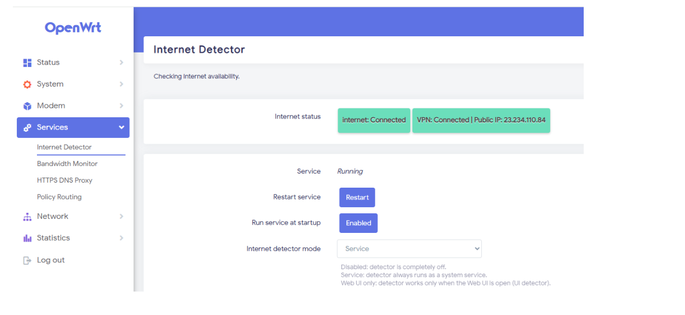

# luci-theme-argon

[简体中文](README_zh.md) | English

Argon is a clean and tidy LuCI theme that is forced to have a login page with a random wallpaper.

## Features
- **Full Internet Detector Status**: This modified version displays the complete status (Internet, VPN, Public IP) directly on the **Status/Overview** page.
- **Configurable**: Toggle the full status display via the Argon Config app.
- **Modern UI**: Fully compatible with OpenWrt 25.12 and the new `apk` package manager.

## Screenshots




## Installation (OpenWrt 25.12.2 and later)

This version uses the new `.apk` format. No extra dependencies are required as they are handled by the package manager.

```bash
# Update package list
apk update

# Download and install the modified Argon theme
wget --no-check-certificate -O luci-theme-argon-2.4.3-r0.apk https://github.com/gonav8/luci-theme-argon/releases/download/v2.4.3-mod/luci-theme-argon-2.4.3-r0.apk
apk add --allow-untrusted ./luci-theme-argon-2.4.3-r0.apk

# Download and install the modified Argon config app
wget --no-check-certificate -O luci-app-argon-config-1.0-r0.apk https://github.com/gonav8/luci-app-argon-config/releases/download/v1.0-mod/luci-app-argon-config-1.0-r0.apk
apk add --allow-untrusted ./luci-app-argon-config-1.0-r0.apk
```

## Legacy Installation (OpenWrt 24.xx and earlier)
For older versions using `.ipk`, please refer to the official [jerrykuku/luci-theme-argon](https://github.com/jerrykuku/luci-theme-argon) repository.
